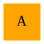
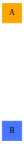
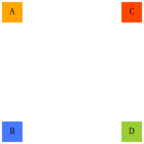
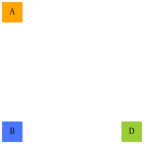

# gva - graphviz animation

`gva` enables you to express an animation (or, a sequence of steps)
in a GraphViz file, like this:

   digraph {
    node[shape=square style=filled];
    A [color=orange pos="0,3!"];		# always visible
    #1-    B [color=royalblue1 pos="0,0!"];	# visible in frames [1-*]
    #2    C [color=orangered pos="3,3!"];	# only visible in frame 2
    #1-3    D [color=olivedrab3 pos="3,0!"];	# visible in frame [1-3]
   }

This yields the following frames:

Frame 0

   digraph {
    size=2;
    node[shape=square style=filled];
    A [color=orange pos="0,3!"];
   }

Frame 1

   digraph {
    size=2;
    node[shape=square style=filled];
    A [color=orange pos="0,3!"];
      B [color=royalblue1 pos="0,0!"];
   }

Frame 2

   digraph {
    size=2;
    node[shape=square style=filled];
    A [color=orange pos="0,3!"];
      B [color=royalblue1 pos="0,0!"];
      C [color=orangered pos="3,3!"];
      D [color=olivedrab3 pos="3,0!"];
   }

Frame 3

   digraph {
    size=2;
    node[shape=square style=filled];
    A [color=orange pos="0,3!"];
      B [color=royalblue1 pos="0,0!"];
      D [color=olivedrab3 pos="3,0!"];
   }

## Usage

   gva.pl <file>

